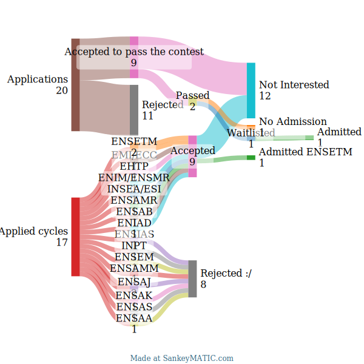

# engineering-schools-ast-prep-guide

As an AST student (Accès Sous Titre DEUG – MIP Informatique, mention Bien), I applied to several top engineering schools in Morocco.  
After months of focused preparation, I successfully gained admission to some of them.  
This repository shares the exact resources, roadmaps, and study strategies I used, to help other AST students achieve the same goal.

  

These results were achieved after only 1 month of nonstop preparation. While I’m proud of the outcome, I believe I could have gained admission to even higher-ranked engineering schools with more time to prepare.

After completing my first year of DEUG (Maths-Physics-CS), I specialized in Computer Science in my second year — focusing entirely on programming, statistics, operating systems, and related subjects.
During that year, I didn’t take any new maths or physics classes, so my foundation covered only about 35–40% of the full maths/physics program required for the engineering entrance exams.

I still remembered some of the first chapters of calculus and linear algebra from my first year, but much of the material had faded due to the one-year gap. That’s why this guide exists — to help AST students like me rebuild their maths/physics foundations in time for competitive exams, no matter their academic background.

I can also make this sound a bit more like a “lesson learned” so it inspires other students and gives them a clear takeaway: “Start early, even if you’re in a CS-heavy program.” 

⚠️ Note: I was specifically focused on IT-related engineering cycles like Software Engineering, Data Engineering, Cybersecurity, AI, and Robotics.
I wasn’t aiming for other cycles such as Mechanical, Electrical, or Industrial Engineering.

